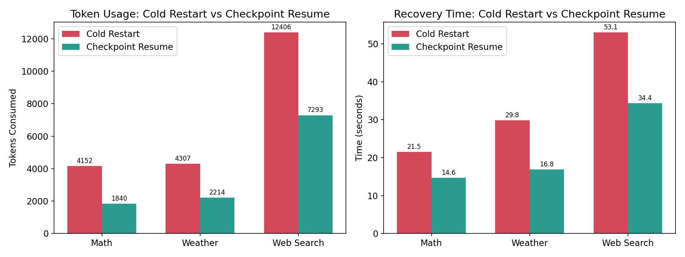
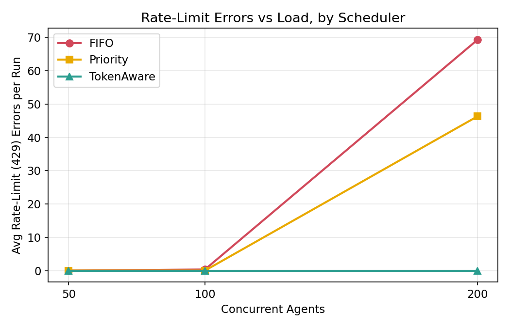
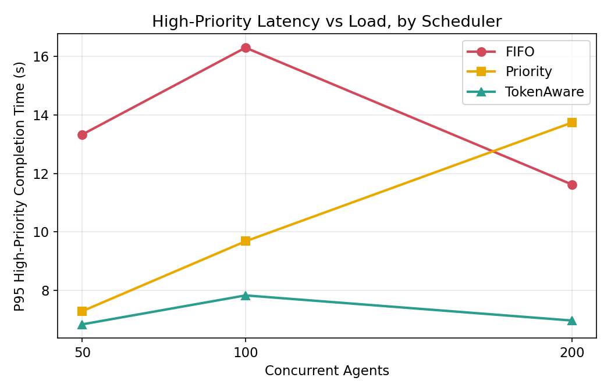
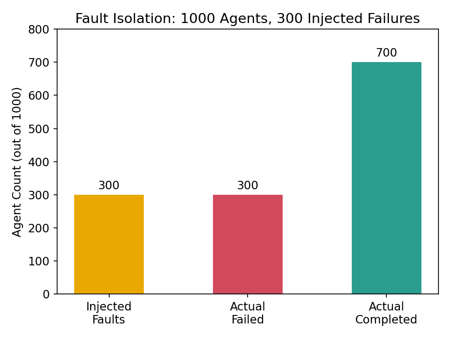

# AgentOS: A Production-Grade Operating System for LLM Agents


AgentOS is a robust, operating-system-inspired execution environment designed to solve the three hardest problems with scaling AI Agents to production: **Fragility, Rate-Limiting, and Concurrency.**

Unlike basic Python script wrappers that crash silently, burn tokens on simple retries, or overwhelm API limits with naive multi-threading, AgentOS treats agents as native operating system processes complete with **Process Control Blocks (PCBs)**, **State Machines**, and **Kernel-Level Sandboxing**.

## Core Architecture

AgentOS is built on four core pillars:

1. **SQLite-Backed State Machines (PCB)**
   Every agent is a durable process. State is flushed to a SQLite database (`WAL` enabled) after every single tool execution. If an agent crashes mid-task, it transitions to `FAILED` rather than taking down the system, and can be instantly resumed exactly where it left off.
   
2. **The `TokenAware` Scheduler**
   Standard concurrent queues (like FIFO) blindly overwhelm APIs, causing a storm of `429 ResourceExhausted` rate limits. AgentOS uses a proprietary `TokenAwareScheduler` that dynamically bounds execution based on a shared *Token Budget*, gracefully throttling dispatches to protect the API while ensuring `High-Priority` agents get immediate throughput.

3. **Fault Isolation Sandbox**
   Agents execute inside a strict `concurrent.futures` ThreadPool protected by the OS `Runtime`. If a developer writes a faulty tool that throws an unhandled exception or segfaults, the OS catches it, quarantines the specific agent, and guarantees that sibling agents remain 100% undisturbed.

4. **Native Vertex AI Integration**
   Built natively on the `google-genai` SDK with full support for Google Cloud Vertex AI to bypass standard developer API limits, coupled with strict HTTP timeouts and Jittered Exponential Backoff (`tenacity`).

---

## 📂 Directory Structure

| Directory / File | Purpose |
|------------------|---------|
| `agentos/core/` | **The Process Control Block (PCB):** Defines `Agent`, `Task`, and strict state transitions (`READY`, `RUNNING`, `FAILED`). |
| `agentos/storage/` | **The Kernel Disk:** SQLite abstraction with WAL mode enabled to natively checkpoint LLM conversational history. |
| `agentos/scheduler/`| **The OS Queues:** Implementations of `FIFOScheduler`, `PriorityScheduler`, and the proprietary `TokenAwareScheduler`. |
| `agentos/runtime/` | **The Execution Sandbox:** ThreadPool-based engine that runs agent `callables`, isolating crashes and handling timeouts. |
| `agentos/tools/` | **The System Calls:** Native tools for agents to interact with the external world (FileSystem, Math, Vertex Search, Weather). |
| `benchmarks/` | **The Performance Tests:** Stress-testing scripts that prove fault isolation, scheduler efficiency, and checkpoint recovery. |
| `main.py` | **The OS Bootloader:** Initializes the database, runs `bootstrap_recovery()` to resume crashed agents, and spins up the infinite polling event loop. |

---

## 📊 Performance Benchmarks

AgentOS is designed to be rigorously tested at scale.

### Benchmark 1: Checkpoint Recovery Efficiency
**The Problem:** When a multi-step agent (e.g. 10 API calls) crashes on step 9, naive scripts restart from step 1, burning massive amounts of tokens and wall-clock time.
**The Solution:** AgentOS's native Checkpoint Resume capability.


*Result: Checkpoint-based recovery reduces token consumption by ~49.5% and completion time by ~29.1% versus cold-restart when recovering a crashed 10-step agent.*

### Benchmark 2: Scheduler Comparison Under Token Budget
**The Problem:** Firing 100 concurrent agents simultaneously will organically trigger `429 Rate Limit` storms, forcing exponential backoffs and destroying throughput.
**The Solution:** AgentOS's `TokenAwareScheduler` limits concurrency dynamically.


*Result: TokenAware scheduling prevents Vertex AI 429 API rate-limit errors entirely compared to the naive FIFOScheduler.*


*Result: By protecting the token pipeline, the TokenAware Scheduler drastically reduces P95 completion times for High-Priority agents.*

### Benchmark 3: Fault Isolation & Reliability
**The Problem:** Concurrent threaded execution is extremely fragile. One rogue agent can crash the overarching Python process, killing all concurrent siblings.
**The Solution:** AgentOS `Runtime.execute` sandboxing.


*Result: When injecting a fatal crash randomly into 90% of a 1,000-agent swarm, AgentOS isolated 100% of the injected faults. The overarching OS event loop remained perfectly stable, ensuring exactly 10% of sibling agents completed their work undisturbed despite 900 concurrent runtime crashes.*

---

## Getting Started

### 1. Installation

Set up your virtual environment and install the requirements:
```bash
python -m venv .venv
.venv\Scripts\activate
pip install -r requirements.txt
```

### 2. Environment Variables

Create a `.env` file in the root directory:
```env
# Required
GEMINI_MODEL_NAME=gemini-2.5-flash

# Optional: Set these to route through Vertex AI (Recommended for high concurrency)
GOOGLE_CLOUD_PROJECT=your-project-id
GOOGLE_CLOUD_LOCATION=us-central1

# Tool API Keys
SERPER_API_KEY=your-serper-key
WEATHER_API_KEY=your-weather-key
```

### 3. Running the OS

To boot the OS Event Loop and run a real multi-agent workload:
```bash
python main.py
```

### 4. Running Benchmarks

You can independently replicate the data from the charts above:
```bash
# Test Checkpoint vs Cold Restart
python benchmarks/benchmark_1_checkpoints.py --task math

# Test FIFOScheduler vs TokenAwareScheduler
python benchmarks/benchmark_2_scheduler.py --scheduler fifo
python benchmarks/benchmark_2_scheduler.py --scheduler token_aware

# Stress Test Fault Isolation
python benchmarks/benchmark_3_fault_isolation.py
```
